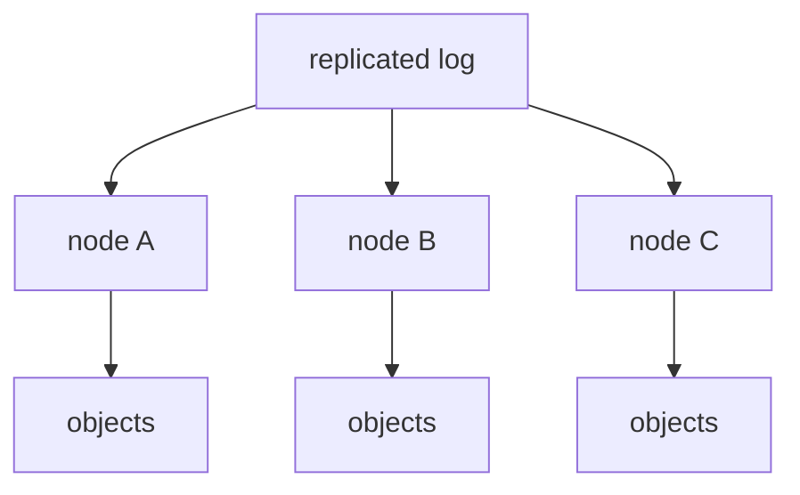

# GOO — Gur's Obvious Objects

GOO is a small, serious Go object store where **object mutations are
first-class durable events**, and the object namespace is a **materialized view
of mutation history**.

The defining idea:

> an object mutation is a durable, ordered, replayable event; the current set
> of objects is just one projection of that event log.

```
                    mutation
                       │
                       ▼
                durable event log
                       │
             ┌─────────┼─────────┐
             ▼         ▼         ▼
          material   stream    (later: replication,
          ized state consumer   consumer groups, DR)
```

GOO is currently **single-node**. The design keeps clean boundaries so this
same event log can later become the replication primitive — see
[Future distributed architecture](#future-distributed-architecture).

---

## Why it exists

Most object stores treat the namespace as the source of truth and treat
change-notifications as an afterthought (a webhook, a pollable list). GOO
flips that: the **append-only mutation log is the source of truth**, and
everything else (the object bytes, the listing, the live stream, future
replicas) is derived from it.

That makes a few things trivially true by construction:

* a consumer can always reconstruct or resync state by replaying events;
* every object mutation has an exact, ordered, durable record;
* crash recovery is "replay the log and rebuild the index";
* a future multi-node design has a natural replication boundary.

---

## Architecture

```
        ┌───────────────┐
CLI     │   cmd/goo     │   tui │  server
        └──────┬────────┘       │
               │               │
       ┌───────▼───────────────▼──────────┐
       │            engine                  │   commit protocol +
       │  (owns store + event log + index)  │   materialized index
       └───────┬───────────────┬───────────┘
               │               │
       ┌───────▼──────┐  ┌─────▼──────┐
       │   store      │  │  events    │  durable WAL (tidwall/wal)
       │  bytes+meta  │  │   (log)    │
       └──────────────┘  └────────────┘
```

Internal packages (small interfaces, clear ownership):

| package           | responsibility                                         |
|-------------------|--------------------------------------------------------|
| `internal/goo`    | domain types (`Event`, `Object`) + bucket/key safety   |
| `internal/events` | durable, sequenced, fsynced event log (WAL wrapper)    |
| `internal/store`  | raw object bytes + metadata on the local filesystem    |
| `internal/engine` | commit protocol + materialized index (the coordinator) |
| `internal/api`    | thin HTTP object API + SSE event stream (no storage)   |
| `internal/tui`    | Bubble Tea terminal UI + treemap                       |

The HTTP and TUI layers own **no** storage logic. They call the engine; the
engine is the single writer of both bytes and events.

---

## Event model

```go
type Event struct {
    Sequence  uint64    // monotonically increasing, == WAL index
    ID        string    // unique id for this mutation (sequence+bucket+key+version)
    Action    string    // "PUT" or "DELETE"
    Bucket    string
    Key       string
    Size      int64
    Hash      string    // sha256 of the object bytes
    Version   uint64    // per-(bucket,key) version, starts at 1
    Timestamp time.Time
}
```

Events are written to a [tidwall/wal](https://github.com/tidwall/wal) log.
The WAL's 1-based index **is** the event `Sequence`, so ordering and
"resume from N" are free and durable. Every successful PUT/DELETE produces
exactly one event and fsyncs it before returning.

SSE uses the sequence as the `id` of each event frame, so a reconnecting
client resumes with `Last-Event-ID: <last seen>` and receives everything
after it.

---

## Storage model

Objects are addressed as `bucket/key`. On disk, under the engine root:

```
<root>/
  data/<bucket>/<2-char-hash-prefix>/<encoded-key>   # object bytes
  meta/<bucket>/<2-char-hash-prefix>/<encoded-key>.json  # metadata
  wal/                                                # the durable event log
```

* **Content addressing / sharding**: keys are sharded by a prefix of
  `sha256("bucket/key")` so a bucket with many objects doesn't create a single
  giant directory.
* **Path safety**: `bucket` and `key` are validated (`internal/goo/validate.go`)
  and every on-disk path is built from those validated components via
  `filepath.Join` — user input is never concatenated into a filesystem path,
  and `..` / absolute segments are rejected.
* **Metadata**: each object carries `bucket, key, size, hash (sha256),
  version, created_at, updated_at`.

---

## Commit protocol & crash consistency

The engine's invariant:

> **the event log is the authoritative source of truth for the namespace.
> an object's bytes are considered committed only after its durable event
> has been fsynced.**

`Put`/`Delete` proceed in this order, under a single mutex:

1. write object bytes + metadata to disk (atomic temp file + rename, fsynced
   directory);
2. append + fsync the event to the WAL (this is the commit point);
3. update the in-memory index.

Consequences and how each bad case is avoided:

* **object bytes exist but no event** → cannot happen after a successful
  return: the event is written last. On a crash *between* (1) and (2), the
  bytes may briefly exist on disk but have no event. On the next `Open`, the
  engine rebuilds its authoritative index from the log and **prunes any
  on-disk object whose `(bucket,key)` is absent from the log** (an orphan
  from an unfinished mutation). So the namespace is always a clean
  materialized view of committed events — no silent orphan objects.
* **event exists but no object bytes** → cannot happen: bytes are written
  and fsynced in step 1, before the event in step 2.
* **lost events** → no: the WAL is fsynced on every append, and sequence
  numbers are monotonic and persisted across restarts.

`Open` replays the entire log to reconstruct the index, which is what makes
the namespace a materialized view of history.

---

## API

### Object API (`internal/api`)

| method | path                              | meaning                         |
|--------|-----------------------------------|---------------------------------|
| PUT    | `/v1/objects/{bucket}/{key}`     | store an object (201)           |
| GET    | `/v1/objects/{bucket}/{key}`     | fetch bytes (200)               |
| HEAD   | `/v1/objects/{bucket}/{key}`     | metadata only (200, no body)    |
| DELETE | `/v1/objects/{bucket}/{key}`     | delete (200)                    |
| GET    | `/v1/buckets/{bucket}`           | list objects in a bucket (JSON) |

Status codes: 201 on fresh PUT, 200 otherwise, 400 on invalid bucket/key,
404 when missing, 500 only on genuine internal failure. Filesystem internals
are never leaked into responses.

### Event stream (SSE)

```
GET /v1/buckets/{bucket}/events
```

* `?from=N` → replay from sequence N (inclusive), then transition to live.
* `Last-Event-ID: N` (sent by browsers on reconnect) → resume from N+1.
* optional `bucket` path param filters to one bucket.

Frames look like:

```
id: 18421
event: object.put
data: {"sequence":18421,"id":"18421-images-cat.jpg-1","action":"PUT","bucket":"images","key":"cat.jpg","size":48291,"hash":"…","version":1,"timestamp":"…"}

id: 18422
event: object.delete
data: {"sequence":18422,…}
```

The stream supports **historical replay → live tailing → reconnect/resume**
with no in-memory-only buffering: history is read from the durable log and
live events come from the engine's subscription.

---

## CLI

```bash
go run ./cmd/goo server                 # start HTTP API + SSE (default :8080)
go run ./cmd/goo put   images/cat.jpg ./cat.jpg
go run ./cmd/goo get   images/cat.jpg ./cat.jpg
go run ./cmd/goo rm    images/cat.jpg
go run ./cmd/goo ls    images
go run ./cmd/goo stat  images/cat.jpg
go run ./cmd/goo events images          # stream events (from=N supported)
go run ./cmd/goo tui                     # launch the terminal UI
```

All commands accept `--root <dir>` to point at a GOO data directory
(defaults to `$GOO_ROOT`, then `./goo-data`). `put/get/rm/ls/stat/events`
operate directly on a local engine; `server` and `tui` serve the API and UI.

---

## TUI

A Bubble Tea (v2) terminal UI with three panes:

```
┌──────────────────────────────────────────┬──────────────────────┐
│ GOO                                  objects: 1,284            │
├──────────────────────────────────────────┼──────────────────────┤
│ EVENT STREAM                            │ STORAGE               │
│ 18421 PUT     images/cat.jpg           │  images   12   1.2MiB │
│ 18420 PUT     images/dog.jpg           │  videos    4   640KiB │
│ 18419 DELETE  logs/old.log             │                       │
│ 18418 PUT     models/yolo.onnx         │      TREEMAP          │
│                                        │  ┌─────────┬────────┐ │
│                                        │  │ images │ videos │ │
├──────────────────────────────────────────┴──────────────────────┤
│ ↑↓ nav  PgUp/PgDn  / search  r replay  t treemap  q quit         │
└────────────────────────────────────────────────────────────────┘
```

* **EVENT STREAM** live-tails the durable log (history seeded on open).
* **STORAGE** shows per-bucket object counts and bytes.
* **TREEMAP** (press `t`) opens as a right-hand panel: buckets are tiles
  sized by byte total (via `jeffwilliams/squarify`), color-cycled, with a
  legend. It handles empty/single/tiny/odd-sized inputs without crashing.
* keys: `↑/↓` navigate the stream, `PgUp/PgDn` page, `/` search-filter,
  `r` replay from the log, `t` toggle treemap, `q` quit.
* the layout reflows on terminal resize.

---

## Guarantees

* **durable**: every committed mutation is fsynced to the WAL before the
  call returns.
* **ordered**: events have monotonically increasing sequence numbers that
  survive restarts.
* **reconstructable**: the namespace can be rebuilt from the event log.
* **replayable**: consumers can replay from any sequence or resume via
  `Last-Event-ID`.
* **path-safe**: bucket/key are validated; no path traversal is possible.
* **no silent event loss**: an event is only "committed" after the fsync.

## Limitations (current)

* **single-node**: there is exactly one GOO node. There is **no replication,
  no consensus, no leader election, no consumer groups** today. Do not call
  GOO distributed — it isn't.
* the treemap visualizes **bytes per bucket**; object-level nesting and the
  `objects` / `event-activity` modes mentioned in the design are not built.
* GET returns the full object into the response; there is no ranged GET yet.

---

## Quickstart

```bash
git clone <your-fork> goo
cd goo

# run the whole test suite (with the race detector)
go test -race ./...

# start a server on :8080 with local data in ./goo-data
go run ./cmd/goo server

# in another shell, push an object and watch the event stream
go run ./cmd/goo put images/cat.jpg ./cat.jpg
curl -N http://localhost:8080/v1/buckets/images/events?from=1

# or just use the terminal UI
go run ./cmd/goo tui
```

No external services required — everything runs locally.

---

## Testing

Every subsystem is developed alongside its tests (`go test ./...`). The suite
covers, at minimum:

* **WAL/event log**: append, read, ordering, replay, restart recovery,
  sequence persistence, malformed records, empty log, bucket filter, live
  unsubscribe.
* **store**: PUT/GET/DELETE/LIST/STAT, overwrites/versioning, checksums,
  missing object/bucket, concurrent access, restart reconstruction, path
  traversal rejection.
* **engine**: every mutation emits an event, failed mutations emit none,
  version correctness, crash/orphan pruning, concurrent commit safety.
* **HTTP/SSE**: CRUD + HEAD + LIST, invalid refs, SSE replay / live / resume
  via `Last-Event-ID` / bucket filter / multiple consumers / client
  disconnect.
* **TUI**: rendering helpers, treemap geometry + robustness, model key
  handling, live event arrival.
* **integration**: the full PUT → SSE receive → disconnect → mutate →
  reconnect-from-sequence → replay flow above.

Benchmarks (`go test -bench . ./internal/engine/`):

```
BenchmarkPut-12         160445 ns/op    6372 B/op    59 allocs/op
BenchmarkGet-12          19772 ns/op     506 B/op     8 allocs/op
BenchmarkEventAppend-12   9140 ns/op    1220 B/op     7 allocs/op
BenchmarkReplay-12    33091079 ns/op  3383126 B/op 45001 allocs/op  (5000 events)
```

Run the full quality gate with:

```bash
gofmt -l . && go vet ./... && go test ./... && go test -race ./...
```

---

## Future distributed architecture

The interfaces are deliberately shaped so a future multi-node GOO reuses the
same event log as its replication primitive:



Planned (not implemented, and not needed for the single-node design):

* replicate the WAL across nodes (the log already has the right shape);
* consumer groups reading the shared log;
* leader election / consensus for the log;
* failure recovery and geo-distributed storage derived from the log.

We deliberately did **not** build consensus or replication up front. The
current node is intentionally single-node; the event-log abstraction is
designed to become the replication primitive later.

---

## License

MIT (or whatever you prefer — set it in `LICENSE`).
